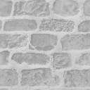

# Cobble_Stone - Retro Texture-Set

Kudos to team [Render96](https://github.com/Render96/Render96Wiki/wiki/cobble_stone-(The-Texture-of-your-Childhood)) [YouTube](https://youtu.be/bsCN0Yx2Vbs?si=wp9G3OGoAuSuikkp) for uncovering this marvel: the use of the Cobble_Stone texture in retro games like Mario 64, Mario Kart 64, Killer Instinct, and more.

I’ve remastered it while preserving its original essence, scaling it to a 128px dimension. With a pixel-art approach in mind, I’m sharing this texture set for use in your shaders.

## Texture Set

Diffuse, Normal, Specular, Roughness, Height

           

Feel free to use these textures in your projects! Feel free to credit me and Render96 !
